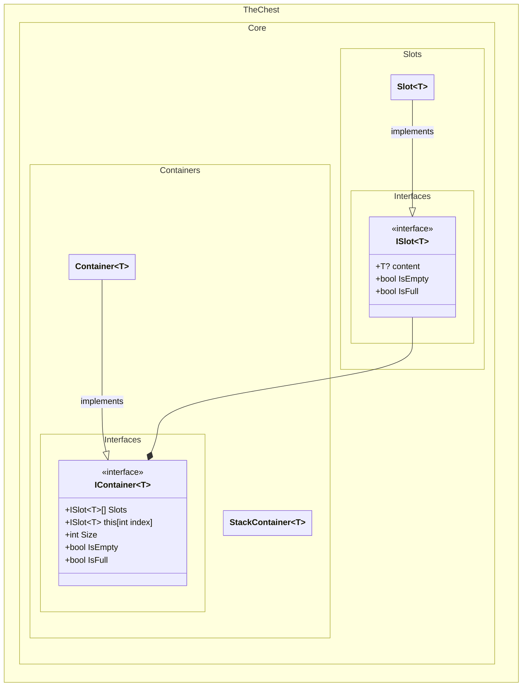

# Class Diagram

```mermaid
---
config:
  theme: mc
  look: classic
  class:
    hideEmptyMembersBox: true
---
classDiagram
direction TB
	namespace TheChest.Core.Containers.Interfaces {
        class IContainer~T~ {
	        +ISlot~T~[] Slots
	        +ISlot~T~ this[int index]
	        +int Size
	        +bool IsEmpty
	        +bool IsFull
        }
	}
	namespace TheChest.Core.Slots.Interfaces {
        class ISlot~T~ {
	        +T? content
	        +bool IsEmpty
	        +bool IsFull
        }
	}
	namespace TheChest.Core.Containers {
        class Container~T~ {
        }
        class StackContainer~T~ {
        }
	}
	namespace TheChest.Core.Slots {
        class Slot~T~ {
        }
	}

	<<interface>> IContainer
	<<interface>> ISlot

    Container --|> IContainer : implements
    ISlot --* IContainer
    Slot --|> ISlot : implements
```

This diagram represents the core classes and their relationships in the project.