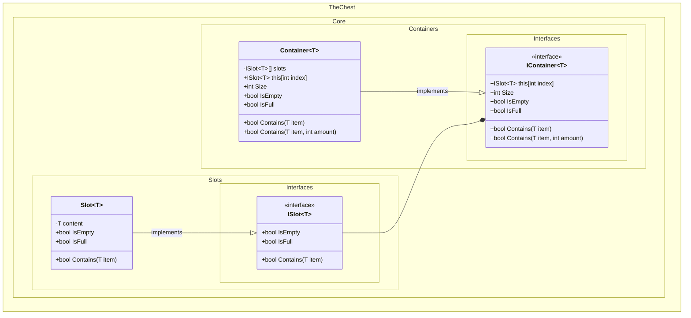
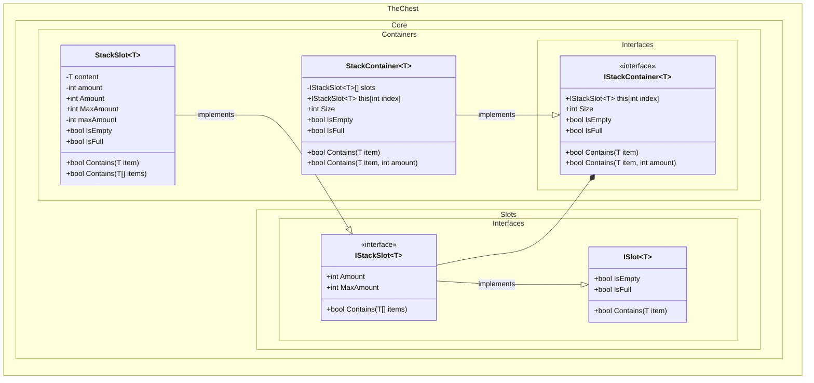
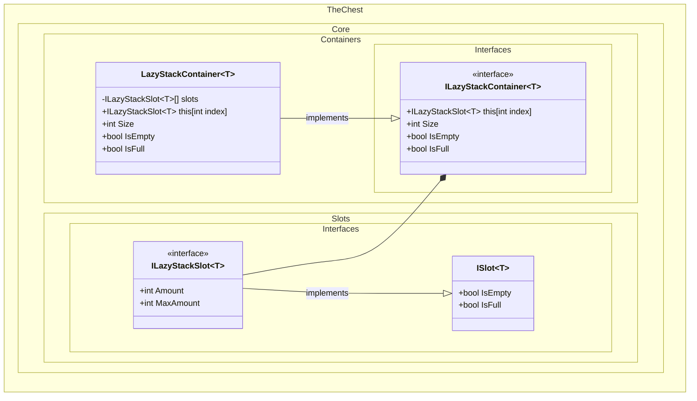

# Class Diagrams

This document contains class diagrams for the core components of TheChest project.

## IContainer Diagram

The `IContainer` diagram represents a generic container interface that holds slots for items.

## IStackContainer Diagram
The `IStackContainer` diagram represents a generic container interface that supports stackable slots, allowing multiple items from the same type to be stored in a single slot.

## ILazyStackContainer Diagram
The `ILazyStackContainer` diagram represents a generic container interface that supports lazy loading of stackable slots, allowing multiple items from the same type to be stored in a single slot.

